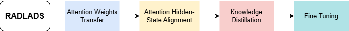
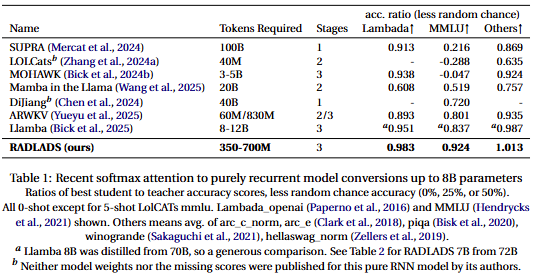

# RADLADS 
## Rapid Attention Distillation to Linear Attention Decoders at Scale

Paper link: https://arxiv.org/abs/2505.03005 

Checkpoints: https://huggingface.co/collections/recursal/radlads-6818ee69e99e729ba8a87102

RADLADS converts traditional softmax attention transformers to use linear attention variants that feature constant-time inference per token. This is accomplished via a three stage distillation process that maintains quality close to the original teacher model. Conversion can be accomplished with 700 million tokens or less of distillation training.

<div align="center" >
     
</div>

We provide two new RWKV variants, RAD-RWKV6 and RAD-RWKV7, that provide an efficient destination architecture for transformer conversions. Our method achieves outstanding results, often with many fewer tokens of training than other methods:

<div align="center" >
     
</div>

Please see the RADLADS paper at https://arxiv.org/abs/2505.03005 for more details.

## What's included in this repository

- Reconfigurable Transformer base model code with support for carried state
- Pluggable time and channel mixer component classes for several model architectures
  - RAD-RWKV6
  - RAD-RWKV7
  - Qwen2.5
- HuggingFace transformers conversion scripts and model code
- simple config system
- lightning based trainer
- lm_eval_harness support
- inference support (limited)

## setup

```
pip install lightning torch flash-linear-attention triton deepspeed wandb ninja --upgrade
```

You can download the DCLM binidx via 

```bash 
mkdir -p data
wget --continue -O data/dclm-10B.idx https://huggingface.co/datasets/recursal/DCLM-10B-Qwen2-binidx/resolve/main/dclm-10B.idx?download=true
wget --continue -O data/dclm-10B.bin https://huggingface.co/datasets/recursal/DCLM-10B-Qwen2-binidx/resolve/main/dclm-10B.bin?download=true
```

You can also convert other datasets or examine the magic primes required for an existing bin/idx dataset using `python3 make_data_hf.py`

## configuration

new config system allows you to specify one or more `-c CONFIG_PATH` in yaml or json format
later configs will override earlier ones
you can also list specific config parameters e.g. `--model.n_layer 12 --train.lr_init: 6e-4`

see configs.py for specific configuration settings in dataclasses

`model.tmix` is the first variety of time mixer, becomes the class at path `f'tmix.tmix_{tmix}.TMix_{tmix}'`

`model.tmix2` is the second variety of time mixer, if any

`model.cmix` is the first variety of channel mixer

`model.cmix2` is the second variety of channel mixer, if any

`model.inv_other_layer_ratio` is the ratio of second variety layers to all layers (e.g. 3 means 2/3 of the first variety and 1/3 of the second variety)

Inherited from LinearAttentionArena, training is broken up into 'mini-batches' of 40320 samples, where a sample is the context length of the model.
`magic_prime` is used to pseudo-randomize the location of these samples within the dataset, and is calculated as below from the LinearAttentionArena documentation:

```
magic_prime = the largest 3n+2 prime smaller than datalen/ctxlen-1 (= 1498226207/512-1 = 2926222.06 in this case) = 2926181 in this case

use https://www.dcode.fr/prime-numbers-search
```

You can also examine the magic primes required for an existing bin/idx dataset using `python3 make_data_hf.py`

## running it

### Example for Qwen2.5-7B-Instruct

Download Qwen/Qwen2.5-7B-Instruct from huggingface
`huggingface-cli download Qwen/Qwen2.5-7B-Instruct`

Convert to PTH format
`python3 convert_hf_to_pth.py` YOUR_CACHED_HF_QWEN_MODEL_LOCATION out/Qwen2.5-7B-Instruct.pth

RADLADS Step 0:
`RWKV_TORCH_COMPILE=0 RWKV_JIT_ON=0 python3 train.py -c configs/qwen7b.yaml -c configs/qwerky7.yaml -c configs/distill1.yaml --train.load_model out/Qwen2.5-7B-Instruct.pth`

RADLADS Step 1:
`RWKV_TORCH_COMPILE=0 RWKV_JIT_ON=0 python3 train.py -c configs/qwen7b.yaml -c configs/qwerky7.yaml -c configs/qwen7binstructteacher.yaml -c configs/distill2.yaml --train.load_model out/L28-D3584-qwerky7_qwen2-1/rwkv-final.pth`

RADLADS Step 2:
`RWKV_TORCH_COMPILE=0 RWKV_JIT_ON=0 python3 train.py -c configs/qwen7b.yaml -c configs/qwerky7.yaml -c configs/qwen7binstructteacher.yaml -c configs/distill3.yaml --train.load_model out/L28-D3584-qwerky7_qwen2-2/rwkv-final.pth`

You can convert the resulting PTH files back to safetensors format for use with HF Transformers via
`python3 convert_to_safetensors.py out/L28-D3584-qwerky7_qwen2-3/rwkv-final.pth RADRWKV7Qwen2.5-7B/model.safetensors`
(note, you can list just a directory and it will emit chunked files instead of a single safetensors but sometimes HF has some issues with this and you have to convert to a single file first, and then from that to the chunks using this same convert_to_safetensors.py tool)

The HF Transformers model code is provided in the rwkv6qwen2 and rwkv7qwen2 subdirectories. You can put together a working HF model mostly by copy-and-pasting. Full details are beyond the scope of this tutorial, but you can look at the pre-converted models to see how it's done.

beware, it will continue from any numbered saved checkpoints still in the directory (if running again in the same dir)

there is also some lm_eval support in run_lm_eval.py, which also uses the same config system

and dragon_test.py which can be used to run a quick inference test, also with the same system


## Citation

If you use this code or find our work valuable, please consider citing RADLADS:

```bibtex
@misc{goldstein2025radladsrapidattentiondistillation,
      title={RADLADS: Rapid Attention Distillation to Linear Attention Decoders at Scale}, 
      author={Daniel Goldstein and Eric Alcaide and Janna Lu and Eugene Cheah},
      year={2025},
      eprint={2505.03005},
      archivePrefix={arXiv},
      primaryClass={cs.CL},
      url={https://arxiv.org/abs/2505.03005}, 
}
```
